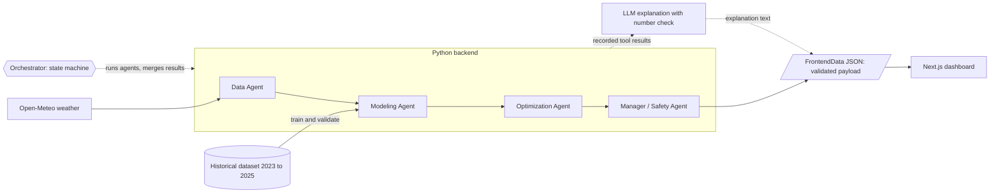

# Solar Farm AI Control System

[](https://github.com/luanhoangle05/solar-ai/actions/workflows/ci.yml)

**Live demo:** https://solar-ai-chi.vercel.app (open the Simulation page for the agents, their reasoning and the 3D farm)

A multi-agent system that decides, hour by hour, whether a row of solar panels
should rotate to a new tilt angle. It weighs the predicted energy gain against
the cost of moving, and a deterministic safety agent has the final word.

Team: Luan (data pipeline), Duy (models, optimization, agents, backend), Tung (frontend).

> **This is a prototype simulation.** No hardware is controlled. Energy labels
> are physics-simulated, not measured production, and the movement and safety
> coefficients are assumptions, not calibrated values. Details are in
> [What is real and what is simulated](#what-is-real-and-what-is-simulated).

## Contents

- [Overall architecture](#overall-architecture)
- [System design](#system-design)
- [Actual results](#actual-results)
- [Testing](#testing)
- [Latency](#latency)
- [Run the demo](#run-the-demo)
- [What is real and what is simulated](#what-is-real-and-what-is-simulated)
- [Known gaps](#known-gaps)
- [Repository guide](#repository-guide)

## Overall architecture



The system has three parts that meet at two contracts:

| Part | Owner | What it does |
| --- | --- | --- |
| Data pipeline (`src/pipeline/`) | Luan | Fetches and validates weather, adds sun position, builds the labeled dataset |
| Models, agents, backend (`src/models/`, `src/agents/`, `src/service/`) | Duy | Predicts energy, optimizes the angle, applies safety, produces one decision per run |
| Dashboard (`frontend/`) | Tung | Reads one validated payload and shows the decision, the agents and the farm |

- **Pipeline to backend:** rows with 13 fixed columns (weather, sun position, panel angle, energy label).
- **Backend to dashboard:** one `FrontendData` JSON object. The backend validates it before writing, and the dashboard validates it again with a matching Zod schema before showing anything.

The dashboard is a static site: it reads the payload file at build time, so the deployed demo needs no server, database or API key.

**Stack:** Python 3.11, PyTorch, XGBoost, pandas, pvlib · Next.js, React, TypeScript, React Three Fiber, Zod · Anthropic API for explanations · GitHub Actions for CI · Vercel for the dashboard.

## System design

### The four agents

Each agent coordinates tools, records what they returned, and hands only its own section of the result to the next. The models and calculators are tools, not agents, and there is one set of agents per decision, not one per panel.

| Agent | Question it answers | Tools it coordinates |
| --- | --- | --- |
| Data | What is the weather for this hour, and can it be trusted? | Weather fetch (with retry and cache fallback), validation, solar position, feature building |
| Modeling | How much energy would the row produce at each candidate angle? | Model comparison, selection by lowest validation RMSE, energy prediction (LSTM, XGBoost) |
| Optimization | Which angle gives the best gain after paying for the movement? | Movement cost, net benefit, optimizer |
| Manager / Safety | Is it safe, and is it worth it? | Wind, angle-limit, data-freshness, panel-status and model checks, then the decision rule |

### Orchestrator

The orchestrator is a plain state machine, not an LLM. It runs the agents in order, merges each one's section into a shared state, and collects their logs. If a stage fails, the failure is recorded and the run still goes to the Manager, which holds or stows. A missing result is never filled in.

### Decision rule

Applied in this order, by code:

1. A severe safety violation (for example wind over the limit): **STOW**.
2. Stale or unreliable data, or any other failed check: **HOLD**.
3. Best net benefit at or below the threshold: **HOLD**.
4. Otherwise: **ROTATE** to the recommended angle.

### Cost model

Everything is in kWh-equivalent for one 20-panel row over one hour.

```text
movement_cost = degrees_moved × (0.002 motor + 0.001 wear)
energy_gain   = predicted_kWh(candidate angle) - predicted_kWh(current angle)
net_benefit   = energy_gain - movement_cost
```

Every candidate angle is scored this way, including staying put at zero cost. The highest net benefit wins; ties go to the least movement, then the lowest angle. The Manager only rotates when the net benefit is above 0.02. The coefficients are prototype assumptions in `src/common/config.py`, and there are no currency figures.

### Where the LLM is used

After an agent's tools have run, the agent asks an LLM to explain its recorded tool results in two or three sentences.

- **It only explains.** The decision is final before the LLM is asked.
- **Its text is checked.** An explanation containing any number that no tool produced is discarded.
- **It is optional.** Without an API key, or if the call fails, agents use templated text and the decision is identical.

### Design choices

| Choice | Why |
| --- | --- |
| Deterministic safety, LLM for wording only | A language model must not be able to override a wind limit or invent a figure |
| Chronological train / validation / test split | Random splits leak future weather into training and inflate accuracy |
| Model selection by a fixed rule | Lowest validation RMSE; the test year is never used to choose |
| Optimize net benefit, not raw energy | Chasing small gains wears out the tracker for nothing |
| One validated payload between backend and dashboard | The two halves can be built and tested independently |
| Unavailable results are null, never zero | A missing model or stage must not look like a real measurement |

More detail, including ownership and contract rules, is in [docs/architecture.md](docs/architecture.md).

## Actual results

Trained on 2023, validated on 2024, tested on 2025. Figures are computed, not estimated, and stored in [data/evaluation/system_evaluation.json](data/evaluation/system_evaluation.json).

**Model accuracy**

| Model | Validation RMSE (kWh) | Test RMSE (kWh) | Picks the best angle (test hours) |
| --- | --- | --- | --- |
| LSTM (PyTorch) | 0.0093 | 0.0101 | 96.4% |
| Boosting (XGBoost) | 0.0358 | 0.0321 | 75.6% |
| Linear regression | not available | not available | not available |
| Random forest | not available | not available | not available |

The two baseline models are not implemented yet, so they are reported as unavailable rather than estimated.

**One year of decisions** for one row, replaying every hour of 2025 against a row fixed at 35 degrees:

| | |
| --- | --- |
| Energy, fixed row | 14,327 kWh |
| Energy, agent-controlled row | 14,977 kWh |
| Movement cost | 8.7 kWh-equivalent |
| Net benefit | +641.5 kWh-equivalent (about 4.5%) |
| Decisions | 177 ROTATE, 8,542 HOLD, 24 STOW |
| Small moves avoided by the threshold | 416 |
| Unsafe rotations | 0 |

This replay scores the selected model's choices with that model's own predictions, so the gain is optimistic. It is not evidence of real-world savings.

**The run shown in the live demo** ([data/evaluation/demo_recommendation.json](data/evaluation/demo_recommendation.json)): the hour starting 2025-06-05 19:00 UTC, with the row at 60 degrees.

| Step | Result |
| --- | --- |
| Model selected | LSTM (validation RMSE 0.009265 kWh) |
| Prediction | 7.867 kWh at 30 degrees, 7.059 kWh at the current 60 degrees |
| Optimization | Gain 0.808 kWh, movement cost 0.090, net benefit +0.7182 kWh-equivalent |
| Safety | All six checks passed |
| Decision | ROTATE to 30 degrees (simulated) |

## Testing

Every pull request and every push to `main` runs both suites on GitHub Actions, plus a frontend type check, lint and production build. Tests never call the LLM or the network.

**Backend: 449 tests** (Python `unittest`)

| Area | Tests | What is checked |
| --- | --- | --- |
| Agents, orchestrator, LLM reasoning, live Data Agent | 128 | Tool coordination, the decision rule (STOW, HOLD, ROTATE), failure routing, and that the LLM cannot change a result |
| Models, evaluation and optimizer | 117 | Training smoke tests, no data leakage in LSTM sequences, metric math, model selection, net-benefit optimization |
| Weather pipeline | 61 | Provider mapping, validation, transform, solar position |
| Dataset loading and example data | 59 | Delivered splits are never re-split, chronological order, labels never used as features |
| Database storage | 32 | PostgreSQL persistence; 23 of these skip when no database is running |
| Shared contracts | 30 | Every payload shape and its consistency rules |
| End-to-end slice | 22 | Data to trained model to agents to a validated dashboard payload |

**Frontend: 459 tests** (Vitest, 22 files): 396 logic and schema tests and 63 page and component render tests.

| Check | Where | Typical time |
| --- | --- | --- |
| Backend test suite | CI | 60 to 120 s including dependency install |
| Frontend type check, lint, tests, build | CI | 50 to 90 s |
| Backend test suite | Laptop | about 25 s |

Not covered: browser interaction tests (dragging, 3D rendering) are manual, and there is no measured test-coverage percentage.

## Latency

Measured with `python -m scripts.benchmark_latency` and stored in [data/evaluation/latency.json](data/evaluation/latency.json). These are wall-clock timings on one laptop (16 logical CPUs, no GPU, full 2023 to 2025 dataset). They describe this prototype on that machine and are not a performance guarantee.

**Making one decision**, once the models are trained and scored:

| Step | Median | Repeats |
| --- | --- | --- |
| Whole decision, all four agents plus payload validation, no LLM | 7.4 ms | 30 |
| Modeling Agent stage (LSTM prediction for 7 candidate angles) | 0.8 ms | 30 |
| Optimization Agent stage | 0.24 ms | 30 |
| Manager / Safety Agent stage | 0.12 ms | 30 |
| LSTM prediction for 7 angles, on its own | 0.64 ms | 100 |
| Boosting prediction for 7 angles, on its own | 9.1 ms | 100 |

**External calls**, which dominate when they are used:

| Step | Median | Range | Repeats |
| --- | --- | --- | --- |
| One LLM explanation (Claude Haiku 4.5) | 1.39 s | 1.26 to 2.46 s | 3 |
| One live weather request (Open-Meteo) | 0.68 s | 0.68 to 0.79 s | 3 |

A run with explanations makes one LLM call per agent, in sequence, so it takes a few seconds; the decision itself is ready in milliseconds and does not wait for the LLM.

**One-off setup** before any decision can be made:

| Step | Time |
| --- | --- |
| Train boosting (61,173 rows) | 18 s |
| Train LSTM | 97 s |
| Score all models on the 2024 validation year (61,376 rows) | 228 s |

**Live dashboard**, five requests per page from one location, HTML only:

| Page | Time to first byte | Full HTML | Size |
| --- | --- | --- | --- |
| Dashboard | 159 ms | 240 ms | 68 KB |
| Simulation | 143 ms | 230 ms | 67 KB |
| Farm | 154 ms | 267 ms | 143 KB |

The pages are static and served from Vercel's cache. Time for the browser to download and draw the 3D scene is not measured.

## Run the demo

### Option 1: open the live demo

https://solar-ai-chi.vercel.app. Nothing to install. It shows the recorded run above.

### Option 2: run the dashboard locally

Requires Node.js. From the repository root in PowerShell:

```powershell
cd frontend
npm install
npm run dev
```

Open http://localhost:3000. By default it shows the mock fixture. To show the same real run as the live demo, create `frontend/.env.local` containing:

```text
SOLAR_FRONTEND_DATA=data/evaluation/demo_recommendation.json
```

Then restart `npm run dev`.

### Option 3: generate a new agent run

Requires Python 3.11. From the repository root:

```powershell
py -3.11 -m venv .venv
.\.venv\Scripts\python.exe -m pip install -r requirements.txt

# A recorded daytime hour from the dataset (drop --skip-lstm to include the LSTM, which is much slower)
.\.venv\Scripts\python.exe -m scripts.run_recommendation --skip-lstm

# The current hour's live forecast for the demo site
.\.venv\Scripts\python.exe -m scripts.run_recommendation --live
```

The result is written to `data/evaluation/latest_recommendation.json`. Point `SOLAR_FRONTEND_DATA` at that file to see it in the dashboard.

| Option | Effect |
| --- | --- |
| `--angle 60` | Sets the row's current angle |
| `--skip-lstm` | Trains boosting only; the LSTM is reported unavailable |
| `--live` | Fetches the current forecast instead of replaying a dataset hour |
| `--no-llm` | Templated explanations only |
| `--output PATH` | Chooses the output file |

**LLM explanations** need an Anthropic API key in a `.env` file at the repository root (the file is git-ignored). Without it everything still runs:

```text
ANTHROPIC_API_KEY=sk-ant-...
```

**Dataset.** The full 2023 to 2025 dataset is not committed; see [docs/full-dataset.md](docs/full-dataset.md). Without it, the committed seasonal sample is used, so your numbers will differ from the results above.

### Option 4: generate a run with Docker

No Python setup needed. From the repository root:

```powershell
docker build -t solar-ai-backend .
docker run --rm -v "${PWD}/out:/out" solar-ai-backend
```

The result is written to `out/recommendation.json`. The image contains the code and the committed seasonal sample only: no API key and not the full dataset.

| To | Add |
| --- | --- |
| Get LLM explanations | `-e ANTHROPIC_API_KEY=sk-ant-...` before the image name |
| Use the full dataset | `-v "<path to gem_2023_2025>:/app/data/generated/gem_2023_2025:ro"` before the image name |
| Change the run | Options after the image name, for example `--angle 60 --output /out/recommendation.json` |
| Write files as yourself on Linux | `--user "$(id -u):$(id -g)"` before the image name |

Options given after the image name replace the defaults (`--skip-lstm --output /out/recommendation.json`), so include `--output /out/...` when you pass your own.

### Run the tests

```powershell
.\.venv\Scripts\python.exe -m unittest discover -s tests

cd frontend
npm test
```

## What is real and what is simulated

| Part | Status |
| --- | --- |
| Weather in the dataset | Real archived forecast weather (Open-Meteo) |
| Energy labels | Physics-simulated with pvlib for a reference row, not measured |
| Model metrics | Computed on held-out data; they measure agreement with that simulation |
| Movement cost and safety limits | Prototype assumptions in `src/common/config.py` |
| Live weather run | Real fetch. The provider gives no forecast issue time, so freshness cannot be established and the Manager always holds |
| Recorded-hour run | A past dataset hour replayed as the forecast, reported as DEGRADED |
| Farm snapshot in a generated run | Simulated: every row shown READY at the control row's angle |
| Control commands | Simulation only; nothing is sent to hardware |
| Row-to-row shading | Not modeled; a decision is computed for one control row per run |
| 3D sun, clouds, sun-tracking demo and Sun lab in the dashboard | Illustrative only; they do not come from the model |

## Known gaps

- The Data Agent in `src/agents/data_agent.py` is still a scaffold. Runs use an
  interim live agent in `src/service/live_data_agent.py` built on the pipeline tools.
- Linear regression and random forest are not implemented.
- The LSTM is not used in a live run because it needs look-back weather history.
- There is no decision history yet; the dashboard's history list is empty for generated runs.
- The live demo is deployed from a fork, so it does not update automatically when this repository changes.

## Repository guide

| Path | Contents |
| --- | --- |
| `src/pipeline/` | Weather client, validation, solar position, storage |
| `src/models/` | XGBoost and LSTM models, evaluation, cost simulation, optimizer |
| `src/agents/` | The agents, orchestrator, trace recording and LLM reasoning |
| `src/service/` | Recommendation service and the interim live Data Agent |
| `src/common/` | Shared contracts, schema and configuration |
| `frontend/` | Next.js dashboard |
| `scripts/` | Run, evaluation, tuning and data-building commands |
| `tests/` | Backend test suite |
| `.github/workflows/ci.yml` | CI: backend tests, backend Docker image, frontend checks |
| `Dockerfile` | Backend image that generates one agent recommendation |
| `docs/architecture.md` | Architecture, ownership and contract rules |
